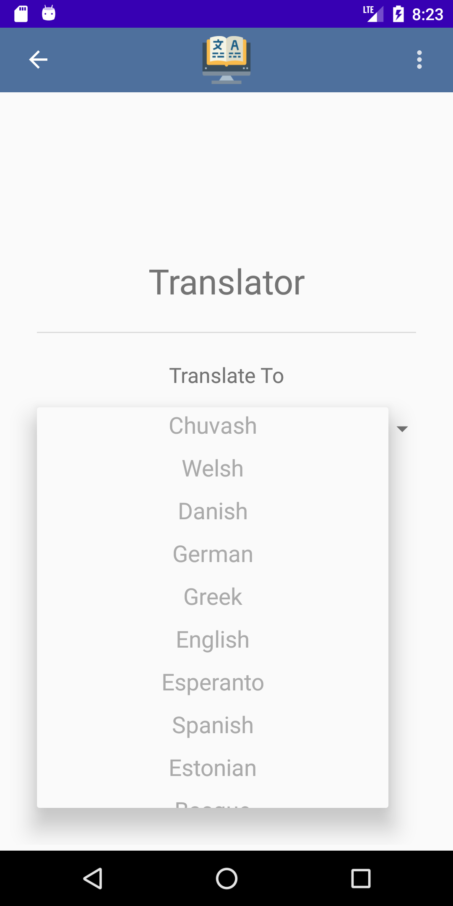
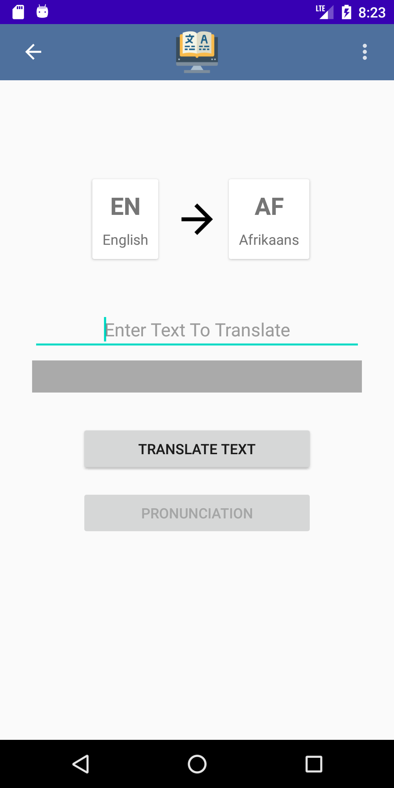

# Language Translator - User Guide

### Main Menu
|Description |	Screenshot |
| :------: | ------ |
|Displayed on app startup| |
|Landing activity. You can navigate to the translator or quiz activities from here by clicking one of the two cards.||
|You can close the app by pressing the three dots in the top-right corner  and selecting the exit option||
|This opens the exit dialog.  Press confirm to close or cancel to resume.| |

---

### Dark Mode
|Description |	Screenshot |
| :------: | ------ |
|You can also access the settings menu by pressing the three dots in the top-right corner and pressing the settings option.||
|Enable/disable dark mode using the slider| |
|Dark mode active| |

---

### Translation
|Description |	Screenshot |
| :------: | ------ |
|Navigate to the translation activity by pressing the language translator card on the home screen||
|Translation activity start screen| |
|Use the drop down to select the langauge you want to translate to| |
|Press the begin translation button when ready to go| |
|Translating activity start screen. Type the text you wish to translate in the text box and press translate| |
|While text is being translated a progress dialog appears| |
|Example of text that has been translated. (Note there is text in the grey box now) | |
|If the language you are translating to supports text to speech, the pronounciate button will not be greyed out. If you press this button the text will be spoken| |

---

### Quiz
|Description |	Screenshot |
| ------ | ------ |
|Navigate to the translation activity by pressing the multichoice quiz card on the home screen||
|Quiz activity start screen. Press any of the quiz cards to begin a quiz| |
|The screen at the start of a quiz. Displays the quiz name, highscore and a button to start the quiz. When you're ready press the button to start the quiz| |
|Example of a quiz question screen. Press one of the four choices to answer the question.| |
|Example of the feedback screen that is displayed after a question is answered.| |
|At the end of a quiz the start screen is shown again. If your score on the quiz was higher than the previous highscore  the highscore will be updated. | |
